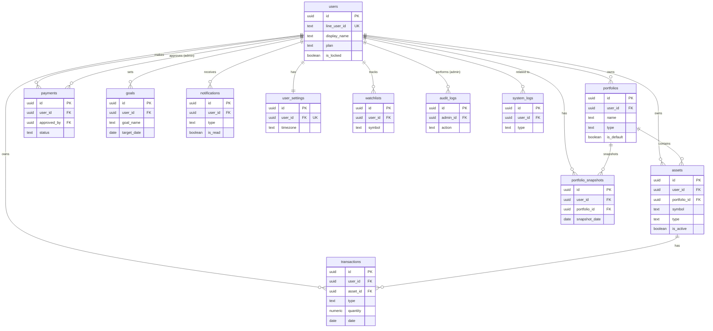

# DATABASE.md — Database Schema

> Database: Supabase (PostgreSQL)
> กฎสำคัญ: ทุก Table ต้องเปิด Row Level Security (RLS)
> ห้ามลบข้อมูลผู้ใช้เด็ดขาด — ใช้ soft delete หรือ lock แทน

---

## 1. ER Diagram (อธิบายเป็นข้อความ)

```
users (1) ──────────────────── (many) portfolios
users (1) ──────────────────── (many) assets
users (1) ──────────────────── (many) transactions
users (1) ──────────────────── (many) payments
users (1) ──────────────────── (many) goals
users (1) ──────────────────── (many) notifications
users (1) ──────────────────── (1)    user_settings
users (1) ──────────────────── (many) watchlists
users (1) ──────────────────── (many) portfolio_snapshots

portfolios (1) ─────────────── (many) assets
portfolios (1) ─────────────── (many) portfolio_snapshots

assets (1) ─────────────────── (many) transactions

admins (1) ─────────────────── (many) audit_logs
admins (1) ─────────────────── (many) payments  [FK: approved_by]
```

### ความสัมพันธ์หลัก

| ตาราง | เชื่อมกับ | ผ่าน Field | ประเภท |
|---|---|---|---|
| portfolios | users | user_id | Many-to-One |
| assets | users | user_id | Many-to-One |
| assets | portfolios | portfolio_id | Many-to-One |
| transactions | users | user_id | Many-to-One |
| transactions | assets | asset_id | Many-to-One |
| payments | users | user_id | Many-to-One |
| payments | admins | approved_by | Many-to-One (nullable) |
| goals | users | user_id | Many-to-One |
| notifications | users | user_id | Many-to-One |
| user_settings | users | user_id | One-to-One |
| watchlists | users | user_id | Many-to-One |
| portfolio_snapshots | users | user_id | Many-to-One |
| portfolio_snapshots | portfolios | portfolio_id | Many-to-One (nullable) |
| audit_logs | admins | admin_id | Many-to-One |

---

## 2. Table Definitions

---

### `users`

เก็บข้อมูลผู้ใช้ที่ล็อกอินผ่าน LINE

> **อัปเดต (PDPA Compliance):** เพิ่ม `pdpa_consented_at` (migration 017) และ
> `anonymized_at` (migration 018) จริงใน Production — `CREATE TABLE` ด้านล่าง
> ยังไม่รวม 2 คอลัมน์นี้ (Doc Drift เดิม) ดูรายละเอียดในตาราง Field ด้านล่าง

```sql
CREATE TABLE users (
  id                UUID          PRIMARY KEY DEFAULT gen_random_uuid(),
  line_user_id      TEXT          NOT NULL UNIQUE,
  display_name      TEXT          NOT NULL,
  picture_url       TEXT,
  plan              TEXT          NOT NULL DEFAULT 'free'
                                  CHECK (plan IN ('free', 'premium', 'premium_plus')),
  plan_expires_at   TIMESTAMPTZ,
  is_locked         BOOLEAN       NOT NULL DEFAULT false,
  locked_at         TIMESTAMPTZ,
  created_at        TIMESTAMPTZ   NOT NULL DEFAULT now(),
  updated_at        TIMESTAMPTZ   NOT NULL DEFAULT now()
);
```

| Field | Type | คำอธิบาย |
|---|---|---|
| id | UUID | Primary Key — ใช้ UUID แทน auto-increment |
| line_user_id | TEXT | LINE User ID (ขึ้นต้นด้วย `U`) — Unique (หลัง Anonymize จะถูกแทนที่ด้วยค่าสังเคราะห์ `anonymized-{id}` — ดู `anonymized_at`) |
| display_name | TEXT | ชื่อที่แสดงใน LINE |
| picture_url | TEXT | URL รูปโปรไฟล์ LINE (nullable) |
| plan | TEXT | แพ็กเกจปัจจุบัน: `free` / `premium` / `premium_plus` |
| plan_expires_at | TIMESTAMPTZ | วันหมดอายุของ Premium (null = ไม่หมดอายุ หรือ Free) |
| is_locked | BOOLEAN | true = อยู่หลัง Grace Period — ล็อคข้อมูล ไม่ใช่ลบ (คนละแนวคิดกับ `anonymized_at` — ดูด้านล่าง) |
| locked_at | TIMESTAMPTZ | วันที่ถูกล็อค (nullable) |
| pdpa_consented_at | TIMESTAMPTZ | (nullable) วันที่ผู้ใช้กดยืนยัน Privacy Policy แบบ Express Opt-in — NULL = ยังไม่เคยกดยืนยัน (ต้องเจอหน้า Consent ก่อนใช้งาน) User เดิมก่อน Migration 017 ถูก Backfill ด้วย `created_at` ของตัวเอง (Grandfather Clause) ดู migration 017 |
| anonymized_at | TIMESTAMPTZ | (nullable) วันที่บัญชีถูก Anonymize ตามคำขอ PDPA Erasure — NULL = บัญชียัง Active ปกติ ไม่ใช่ NULL = `line_user_id`/`display_name`/`picture_url` ถูกแทนที่ด้วยข้อมูลไม่ระบุตัวตนแล้ว และ `requireAuth` จะปฏิเสธ Token เดิมทันที (401 ACCOUNT_ERASED) ดู migration 018 |
| created_at | TIMESTAMPTZ | วันที่สมัคร |
| updated_at | TIMESTAMPTZ | วันที่อัพเดทล่าสุด |

**Index:**
```sql
CREATE INDEX idx_users_line_user_id ON users(line_user_id);
CREATE INDEX idx_users_plan ON users(plan);
CREATE INDEX idx_users_plan_expires_at ON users(plan_expires_at)
  WHERE plan != 'free';
```

---

### `portfolios`

เก็บพอร์ตลงทุนแยกประเภทของแต่ละผู้ใช้ (Multiple Portfolio — Premium เท่านั้น)

```sql
CREATE TABLE portfolios (
  id          UUID        PRIMARY KEY DEFAULT gen_random_uuid(),
  user_id     UUID        NOT NULL REFERENCES users(id),
  name        TEXT        NOT NULL,
  type        TEXT        NOT NULL
              CHECK (type IN ('crypto', 'stock_th', 'stock_us', 'etf', 'fund', 'custom')),
  is_default  BOOLEAN     NOT NULL DEFAULT false,
  created_at  TIMESTAMPTZ NOT NULL DEFAULT now(),
  updated_at  TIMESTAMPTZ NOT NULL DEFAULT now()
);
```

| Field | Type | คำอธิบาย |
|---|---|---|
| id | UUID | Primary Key |
| user_id | UUID | FK → users.id |
| name | TEXT | ชื่อพอร์ต เช่น "พอร์ต Crypto", "หุ้นไทย" |
| type | TEXT | ประเภทพอร์ต: `crypto` / `stock_th` / `stock_us` / `etf` / `fund` / `custom` |
| is_default | BOOLEAN | true = พอร์ตเริ่มต้น (ใช้กับ Free ที่มีพอร์ตเดียว) |
| created_at | TIMESTAMPTZ | วันที่สร้างพอร์ต |
| updated_at | TIMESTAMPTZ | วันที่อัพเดทล่าสุด |

**Index:**
```sql
CREATE INDEX idx_portfolios_user_id ON portfolios(user_id);
```

---

### `assets`

เก็บสินทรัพย์ที่ผู้ใช้ถือครองอยู่

```sql
CREATE TABLE assets (
  id           UUID        PRIMARY KEY DEFAULT gen_random_uuid(),
  user_id      UUID        NOT NULL REFERENCES users(id),
  portfolio_id UUID        REFERENCES portfolios(id),
  symbol       TEXT        NOT NULL,
  name         TEXT        NOT NULL,
  type         TEXT        NOT NULL
               CHECK (type IN ('crypto', 'stock_th', 'stock_us', 'etf', 'fund', 'gold_bar', 'gold_ornament')),
  -- กองทุนรวมไทย (Round 7) — เก็บ proj_id + fund_class_name ของ SEC ไว้ Mark-to-market
  -- (nullable: สินทรัพย์ชนิดอื่นไม่ใช้) ดู migration 010
  proj_id          TEXT,
  fund_class_name  TEXT,
  is_active    BOOLEAN     NOT NULL DEFAULT true,
  created_at   TIMESTAMPTZ NOT NULL DEFAULT now(),
  updated_at   TIMESTAMPTZ NOT NULL DEFAULT now(),
  -- migration 014 — NULLS NOT DISTINCT (PostgreSQL 15+) ป้องกัน Duplicate เมื่อ
  -- portfolio_id IS NULL (Free-tier ไม่มี Multiple Portfolio คือกรณีส่วนใหญ่) เหตุผล
  -- เดียวกับ portfolio_snapshots ด้านล่าง (§ "ข้อควรระวัง: NULL กับ UNIQUE Constraint")
  -- — Plain UNIQUE เดิมถือว่า NULL <> NULL จึงปล่อยให้สอง Symbol เดียวกันของ User
  -- เดียวกันสร้างซ้ำเป็นคนละ asset_id ได้ ทำให้ Transaction History แตกกระจาย
  UNIQUE NULLS NOT DISTINCT (user_id, symbol, portfolio_id)
);
```

| Field | Type | คำอธิบาย |
|---|---|---|
| id | UUID | Primary Key |
| user_id | UUID | FK → users.id |
| portfolio_id | UUID | FK → portfolios.id (nullable สำหรับ Free ที่ไม่มี Multiple Portfolio) |
| symbol | TEXT | ตัวย่อสินทรัพย์ เช่น `BTC`, `PTT`, `AAPL` |
| name | TEXT | ชื่อเต็ม เช่น "Bitcoin", "PTT Public Company" |
| type | TEXT | ประเภทสินทรัพย์: `crypto` / `stock_th` / `stock_us` / `etf` / `fund` |
| is_active | BOOLEAN | false = ขายออกหมดแล้ว แต่ยังเก็บประวัติ |
| created_at | TIMESTAMPTZ | วันที่เพิ่มสินทรัพย์ |
| updated_at | TIMESTAMPTZ | วันที่อัพเดทล่าสุด |

**Index:**
```sql
CREATE INDEX idx_assets_user_id ON assets(user_id);
CREATE INDEX idx_assets_portfolio_id ON assets(portfolio_id);
CREATE INDEX idx_assets_user_symbol ON assets(user_id, symbol);
```

---

### `transactions`

เก็บประวัติการซื้อ/ขายสินทรัพย์ทุกรายการ

```sql
CREATE TABLE transactions (
  id              UUID        PRIMARY KEY DEFAULT gen_random_uuid(),
  user_id         UUID        NOT NULL REFERENCES users(id),
  asset_id        UUID        NOT NULL REFERENCES assets(id),
  type            TEXT        NOT NULL CHECK (type IN ('buy', 'sell')),
  amount_thb      NUMERIC(15,2) NOT NULL CHECK (amount_thb > 0),
  price_per_unit  NUMERIC(20,8) NOT NULL CHECK (price_per_unit > 0),
  quantity        NUMERIC(20,8) NOT NULL CHECK (quantity > 0),
  fee_thb         NUMERIC(10,2) NOT NULL DEFAULT 0,
  date            DATE        NOT NULL,
  note            TEXT,
  source          TEXT        NOT NULL DEFAULT 'line'
                  CHECK (source IN ('line', 'web', 'slip_ai')),
  -- แนบรูปสลิป AI OCR (S8 — migration 021) — Storage path (ไม่ใช่ URL) ใน Bucket
  -- 'transaction-slips' ซึ่งเป็น Private Bucket: ต้อง Sign ก่อนเปิดดูเสมอ
  -- NULL สำหรับธุรกรรมที่ไม่ได้มาจากสลิป (พิมพ์เอง/Web/Bulk Import) = กรณีส่วนใหญ่
  slip_image_path TEXT,
  created_at      TIMESTAMPTZ NOT NULL DEFAULT now()
);
```

| Field | Type | คำอธิบาย |
|---|---|---|
| id | UUID | Primary Key |
| user_id | UUID | FK → users.id |
| asset_id | UUID | FK → assets.id |
| type | TEXT | ประเภท: `buy` / `sell` |
| amount_thb | NUMERIC(15,2) | จำนวนเงินเป็นบาท |
| price_per_unit | NUMERIC(20,8) | ราคาต่อหน่วย (รองรับ Crypto ทศนิยมสูง) |
| quantity | NUMERIC(20,8) | จำนวนหน่วยที่ซื้อ/ขาย |
| fee_thb | NUMERIC(10,2) | ค่าธรรมเนียม (บาท) |
| date | DATE | วันที่ทำธุรกรรม (ไม่ใช่วันที่บันทึก) |
| note | TEXT | หมายเหตุ (nullable) |
| source | TEXT | ช่องทางบันทึก: `line` / `web` / `slip_ai` (ตั้ง `slip_ai` เมื่อมาจาก AI Slip OCR — S8) |
| slip_image_path | TEXT | Storage path รูปสลิปต้นฉบับใน Bucket `transaction-slips` (Private) — nullable |
| created_at | TIMESTAMPTZ | วันที่บันทึกเข้าระบบ |

**Index:**
```sql
CREATE INDEX idx_transactions_user_id ON transactions(user_id);
CREATE INDEX idx_transactions_asset_id ON transactions(asset_id);
CREATE INDEX idx_transactions_date ON transactions(date DESC);
CREATE INDEX idx_transactions_user_date ON transactions(user_id, date DESC);
```

---

### `payments`

เก็บประวัติการชำระเงินและสถานะการตรวจสอบสลิป

> ⚠️ **Doc Drift ที่พบระหว่าง Payment Beta (S5 Group C):** Block `CREATE TABLE` ด้านล่าง
> นี้เป็น Schema แบบเก่า/ตั้งใจไว้ (Aspirational) ที่ **ไม่ตรงกับ Schema จริงใน Production**
> — Schema จริงคือ `migrations/004_create_payments.sql` (+ ส่วนขยายใน `010`, `015`) ซึ่งใช้
> คนละชื่อคอลัมน์/ค่า status กันเยอะพอสมควร เช่น `slip_url` → `slip_image_url` จริง,
> ไม่มีคอลัมน์ `amount`/`plan`/`duration`/`reject_reason`/`approved_by`/`reviewed_at`/
> `approved_at` เลย (ใช้ `billing_period`/`base_amount_thb`/`satang_tag`/`amount_thb`/
> `confirmed_by`/`confirmed_at` แทน) และค่า `status` จริงคือ `pending`/`confirmed`/
> `rejected`/`expired` (ไม่มี `reviewing`/`approved`) — ตรวจสอบตรงกับ
> `backend/src/repositories/payment.repository.js` แล้วก่อนแก้ Task นี้ ยังไม่ได้ Rewrite
> Section นี้ทั้งหมด (Scope ของ Task นี้แคบกว่านั้น) แนะนำเป็นงาน Cleanup แยกต่างหาก —
> ด้านล่างนี้แก้เฉพาะส่วน `slip_hash` ที่ Task นี้เพิ่มเข้าไปจริงใน Production
> (`migrations/015_add_slip_hash_to_payments.sql`) ให้ตรงกับของจริงเท่านั้น
>
> **อัปเดตเพิ่ม (Lock-Until-Resolved, migration 016):** เพิ่มคอลัมน์
> `amount_released_at` จริงใน Production ด้วย (`migrations/016_add_amount_released_at_to_payments.sql`)
> — แก้บั๊ก PromptPay QR Reuse: เดิม `idx_payments_pending_amount_unique` (Scope
> ตาม `status='pending'`) ปล่อยยอด `amount_thb` คืนทันทีที่ Cron เปลี่ยน status เป็น
> `'expired'` ทั้งที่ QR ยังสแกนโอนเข้าได้จริง (Static Tag 29 ไม่มี Expiry ระดับธนาคาร)
> ตอนนี้แยก "ยอดว่างให้ใช้ซ้ำหรือยัง" ออกจาก `status` ทั้งหมดผ่านคอลัมน์ใหม่นี้แทน

```sql
CREATE TABLE payments (
  id           UUID        PRIMARY KEY DEFAULT gen_random_uuid(),
  user_id      UUID        NOT NULL REFERENCES users(id),
  amount       NUMERIC(10,2) NOT NULL CHECK (amount > 0),
  plan         TEXT        NOT NULL CHECK (plan IN ('premium', 'premium_plus')),
  duration     TEXT        NOT NULL CHECK (duration IN ('monthly', 'yearly')),
  slip_url     TEXT        NOT NULL,
  -- slip_hash (migration 015 — Payment Beta): NULLABLE จริง ไม่ใช่ UNIQUE ที่ระดับ Column
  -- (ตรวจสลิปซ้ำเป็น App-level Check ผ่าน payment.service.assertSlipNotReused — Reject
  -- เฉพาะตอนซ้ำกับคำขอที่ confirmed แล้วเท่านั้น อนุญาต Retry ได้ถ้าคำขอเดิม rejected/expired)
  slip_hash    TEXT,
  status       TEXT        NOT NULL DEFAULT 'pending'
               CHECK (status IN ('pending', 'reviewing', 'approved', 'rejected', 'expired')),
  reject_reason TEXT,
  approved_by  UUID        REFERENCES users(id),
  created_at   TIMESTAMPTZ NOT NULL DEFAULT now(),
  reviewed_at  TIMESTAMPTZ,
  approved_at  TIMESTAMPTZ,
  expires_at   TIMESTAMPTZ
);
```

| Field | Type | คำอธิบาย |
|---|---|---|
| id | UUID | Primary Key |
| user_id | UUID | FK → users.id |
| amount | NUMERIC(10,2) | จำนวนเงินที่ชำระ (บาท) |
| plan | TEXT | แพ็กเกจที่ต้องการ: `premium` / `premium_plus` |
| duration | TEXT | ระยะเวลา: `monthly` / `yearly` |
| slip_url | TEXT | URL รูปสลิปที่เก็บใน Supabase Storage |
| slip_hash | TEXT | SHA-256 Hex ของรูปสลิป (nullable) — ตรวจจับส่งสลิปซ้ำ ดู migration 015 + payment.service.assertSlipNotReused |
| amount_released_at | TIMESTAMPTZ | (nullable) NULL = ยอด `amount_thb` ยังถูกล็อกอยู่ (ห้ามคำขอใหม่ใช้ยอดนี้ซ้ำ); ไม่ใช่ NULL = ปล่อยแล้ว นำยอดกลับมาใช้ได้ ตั้งค่าตอน Admin Approve/Reject หรือ Auto-release Cron 7 วัน ดู migration 016 |
| status | TEXT | สถานะ: `pending` → `reviewing` → `approved` / `rejected` / `expired` |
| reject_reason | TEXT | เหตุผลที่ Reject (nullable) |
| approved_by | UUID | FK → users.id ของ Admin ที่ Approve (nullable) |
| created_at | TIMESTAMPTZ | วันที่ส่งสลิป |
| reviewed_at | TIMESTAMPTZ | วันที่ Admin เริ่มตรวจ (nullable) |
| approved_at | TIMESTAMPTZ | วันที่ Approve (nullable) |
| expires_at | TIMESTAMPTZ | วันที่สลิปหมดอายุ (nullable) |

**Index:**
```sql
CREATE INDEX idx_payments_user_id ON payments(user_id);
CREATE INDEX idx_payments_status ON payments(status);
-- slip_hash: Partial Index (เฉพาะแถวที่มีค่า) — migration 015
CREATE INDEX idx_payments_slip_hash ON payments(slip_hash) WHERE slip_hash IS NOT NULL;
CREATE INDEX idx_payments_created_at ON payments(created_at DESC);
-- Lock-Until-Resolved (migration 016) — แทนที่ idx_payments_pending_amount_unique เดิม
-- (Scope ตาม status='pending') ด้วย Scope ตาม amount_released_at IS NULL แทน
CREATE UNIQUE INDEX idx_payments_amount_unresolved_unique
  ON payments(amount_thb) WHERE amount_released_at IS NULL;
-- รองรับ Auto-release Cron สแกนหาแถว unresolved เกิน 7 วัน
CREATE INDEX idx_payments_unresolved_created_at
  ON payments(created_at) WHERE amount_released_at IS NULL;
```

---

### `goals`

เก็บเป้าหมายการลงทุน (Premium: 1 เป้าหมาย, Premium+: ไม่จำกัด)

```sql
CREATE TABLE goals (
  id             UUID        PRIMARY KEY DEFAULT gen_random_uuid(),
  user_id        UUID        NOT NULL REFERENCES users(id),
  goal_name      TEXT        NOT NULL,
  target_amount  NUMERIC(15,2) NOT NULL CHECK (target_amount > 0),
  target_date    DATE        NOT NULL,
  current_amount NUMERIC(15,2) NOT NULL DEFAULT 0,
  is_achieved    BOOLEAN     NOT NULL DEFAULT false,
  created_at     TIMESTAMPTZ NOT NULL DEFAULT now(),
  updated_at     TIMESTAMPTZ NOT NULL DEFAULT now()
);
```

| Field | Type | คำอธิบาย |
|---|---|---|
| id | UUID | Primary Key |
| user_id | UUID | FK → users.id |
| goal_name | TEXT | ชื่อเป้าหมาย เช่น "ดาวน์รถ", "เที่ยวญี่ปุ่น" |
| target_amount | NUMERIC(15,2) | จำนวนเงินที่ตั้งเป้าหมาย (บาท) |
| target_date | DATE | วันที่ต้องการบรรลุเป้าหมาย |
| current_amount | NUMERIC(15,2) | จำนวนเงินสะสมปัจจุบัน |
| is_achieved | BOOLEAN | true = บรรลุเป้าหมายแล้ว |
| created_at | TIMESTAMPTZ | วันที่สร้างเป้าหมาย |
| updated_at | TIMESTAMPTZ | วันที่อัพเดทล่าสุด |

**Index:**
```sql
CREATE INDEX idx_goals_user_id ON goals(user_id);
```

---

### `notifications`

เก็บประวัติการแจ้งเตือนทุกประเภทที่ส่งผ่าน LINE

```sql
CREATE TABLE notifications (
  id         UUID        PRIMARY KEY DEFAULT gen_random_uuid(),
  user_id    UUID        NOT NULL REFERENCES users(id),
  type       TEXT        NOT NULL
             CHECK (type IN (
               'dca_reminder', 'weekly_summary', 'monthly_summary',
               'premium_expiry', 'premium_locked', 'payment_approved',
               'payment_rejected', 'concentration_alert'
             )),
  message    TEXT        NOT NULL,
  is_read    BOOLEAN     NOT NULL DEFAULT false,
  sent_at    TIMESTAMPTZ NOT NULL DEFAULT now()
);
```

| Field | Type | คำอธิบาย |
|---|---|---|
| id | UUID | Primary Key |
| user_id | UUID | FK → users.id |
| type | TEXT | ประเภทการแจ้งเตือน |
| message | TEXT | เนื้อหาข้อความที่ส่ง |
| is_read | BOOLEAN | true = ผู้ใช้เปิดอ่านแล้ว |
| sent_at | TIMESTAMPTZ | วันเวลาที่ส่ง |

**Index:**
```sql
CREATE INDEX idx_notifications_user_id ON notifications(user_id);
CREATE INDEX idx_notifications_sent_at ON notifications(sent_at DESC);
CREATE INDEX idx_notifications_type ON notifications(type);
```

---

### `audit_logs`

บันทึก Action ทุกอย่างของ Admin — ต้องไม่มีการลบหรือแก้ไข

```sql
CREATE TABLE audit_logs (
  id         UUID        PRIMARY KEY DEFAULT gen_random_uuid(),
  admin_id   UUID        NOT NULL REFERENCES users(id),
  action     TEXT        NOT NULL
             CHECK (action IN (
               'approve_payment', 'reject_payment',
               'edit_user', 'change_user_role',
               'delete_user_data', 'broadcast_message',
               'change_admin_role', 'login', 'logout'
             )),
  target_id  UUID,
  target_type TEXT,
  detail     JSONB,
  ip_address TEXT,
  created_at TIMESTAMPTZ NOT NULL DEFAULT now()
);
```

| Field | Type | คำอธิบาย |
|---|---|---|
| id | UUID | Primary Key |
| admin_id | UUID | FK → users.id ของ Admin ที่ทำ Action |
| action | TEXT | ประเภท Action |
| target_id | UUID | ID ของ Record ที่ถูกกระทำ (nullable) |
| target_type | TEXT | ประเภท Record เช่น `user`, `payment` (nullable) |
| detail | JSONB | รายละเอียดเพิ่มเติม เช่น ค่าก่อน/หลังแก้ไข |
| ip_address | TEXT | IP ของ Admin (nullable) |
| created_at | TIMESTAMPTZ | วันเวลาที่ทำ Action |

**Index:**
```sql
CREATE INDEX idx_audit_logs_admin_id ON audit_logs(admin_id);
CREATE INDEX idx_audit_logs_created_at ON audit_logs(created_at DESC);
CREATE INDEX idx_audit_logs_action ON audit_logs(action);
CREATE INDEX idx_audit_logs_target_id ON audit_logs(target_id) WHERE target_id IS NOT NULL;
```

---

### `portfolio_snapshots`

บันทึกมูลค่าพอร์ตรายวัน สำหรับ Timeline, Chart และ Portfolio Replay

```sql
CREATE TABLE portfolio_snapshots (
  id              UUID        PRIMARY KEY DEFAULT gen_random_uuid(),
  user_id         UUID        NOT NULL REFERENCES users(id),
  portfolio_id    UUID        REFERENCES portfolios(id),
  total_value     NUMERIC(15,2) NOT NULL,
  total_invested  NUMERIC(15,2) NOT NULL,
  profit_loss     NUMERIC(15,2) NOT NULL,
  roi             NUMERIC(8,4)  NOT NULL,
  snapshot_date   DATE        NOT NULL,
  created_at      TIMESTAMPTZ NOT NULL DEFAULT now(),
  UNIQUE (user_id, portfolio_id, snapshot_date)
);
```

| Field | Type | คำอธิบาย |
|---|---|---|
| id | UUID | Primary Key |
| user_id | UUID | FK → users.id |
| portfolio_id | UUID | FK → portfolios.id (nullable = snapshot รวมทุกพอร์ต) |
| total_value | NUMERIC(15,2) | มูลค่าพอร์ตทั้งหมด ณ วันนั้น (บาท) |
| total_invested | NUMERIC(15,2) | เงินลงทุนสะสม ณ วันนั้น (บาท) |
| profit_loss | NUMERIC(15,2) | กำไร/ขาดทุน (บาท) |
| roi | NUMERIC(8,4) | ROI เป็น % เช่น 12.5000 = 12.5% |
| snapshot_date | DATE | วันที่บันทึก |
| created_at | TIMESTAMPTZ | วันที่สร้าง Record |

**Index:**
```sql
CREATE INDEX idx_snapshots_user_id ON portfolio_snapshots(user_id);
CREATE INDEX idx_snapshots_user_date ON portfolio_snapshots(user_id, snapshot_date DESC);
CREATE INDEX idx_snapshots_portfolio_date ON portfolio_snapshots(portfolio_id, snapshot_date DESC)
  WHERE portfolio_id IS NOT NULL;
```

---

### `user_settings`

เก็บการตั้งค่าของผู้ใช้แต่ละคน — One-to-One กับ users

```sql
CREATE TABLE user_settings (
  id                    UUID        PRIMARY KEY DEFAULT gen_random_uuid(),
  user_id               UUID        NOT NULL UNIQUE REFERENCES users(id),
  currency              TEXT        NOT NULL DEFAULT 'THB',
  timezone              TEXT        NOT NULL DEFAULT 'Asia/Bangkok',
  language              TEXT        NOT NULL DEFAULT 'th',
  dca_reminder_day      SMALLINT    CHECK (dca_reminder_day BETWEEN 1 AND 31),
  notification_enabled  BOOLEAN     NOT NULL DEFAULT true,
  weekly_summary        BOOLEAN     NOT NULL DEFAULT true,
  monthly_summary       BOOLEAN     NOT NULL DEFAULT true,
  created_at            TIMESTAMPTZ NOT NULL DEFAULT now(),
  updated_at            TIMESTAMPTZ NOT NULL DEFAULT now()
);
```

| Field | Type | คำอธิบาย |
|---|---|---|
| id | UUID | Primary Key |
| user_id | UUID | FK → users.id — Unique (One-to-One) |
| currency | TEXT | สกุลเงิน เช่น `THB`, `USD` |
| timezone | TEXT | เขตเวลา เช่น `Asia/Bangkok` |
| language | TEXT | ภาษา เช่น `th`, `en` |
| dca_reminder_day | SMALLINT | วันที่ของเดือนที่ต้องการรับแจ้งเตือน DCA (1–31) |
| notification_enabled | BOOLEAN | เปิด/ปิดการแจ้งเตือนทั้งหมด |
| weekly_summary | BOOLEAN | รับสรุปรายสัปดาห์หรือไม่ (Premium) |
| monthly_summary | BOOLEAN | รับสรุปรายเดือนหรือไม่ (Premium) |
| created_at | TIMESTAMPTZ | วันที่สร้าง |
| updated_at | TIMESTAMPTZ | วันที่อัพเดทล่าสุด |

**Index:**
```sql
CREATE INDEX idx_user_settings_user_id ON user_settings(user_id);
```

---

### `watchlists`

เก็บสินทรัพย์ที่ผู้ใช้ติดตามแต่ยังไม่ได้ลงทุน (Premium)

```sql
CREATE TABLE watchlists (
  id         UUID        PRIMARY KEY DEFAULT gen_random_uuid(),
  user_id    UUID        NOT NULL REFERENCES users(id),
  symbol     TEXT        NOT NULL,
  name       TEXT        NOT NULL,
  type       TEXT        NOT NULL
             CHECK (type IN ('crypto', 'stock_th', 'stock_us', 'etf', 'fund')),
  note       TEXT,
  created_at TIMESTAMPTZ NOT NULL DEFAULT now(),
  UNIQUE (user_id, symbol)
);
```

| Field | Type | คำอธิบาย |
|---|---|---|
| id | UUID | Primary Key |
| user_id | UUID | FK → users.id |
| symbol | TEXT | ตัวย่อสินทรัพย์ |
| name | TEXT | ชื่อเต็ม |
| type | TEXT | ประเภทสินทรัพย์ |
| note | TEXT | หมายเหตุส่วนตัว (nullable) |
| created_at | TIMESTAMPTZ | วันที่เพิ่มเข้า Watchlist |

**Index:**
```sql
CREATE INDEX idx_watchlists_user_id ON watchlists(user_id);
```

---

### `system_logs`

เก็บ Error และ Event สำคัญของระบบ สำหรับ Developer และ Admin

```sql
CREATE TABLE system_logs (
  id          UUID        PRIMARY KEY DEFAULT gen_random_uuid(),
  type        TEXT        NOT NULL
              CHECK (type IN ('error', 'warning', 'info')),
  source      TEXT        NOT NULL
              CHECK (source IN ('webhook', 'parser', 'database', 'payment', 'notification', 'auth', 'cron')),
  message     TEXT        NOT NULL,
  stack_trace TEXT,
  user_id     UUID        REFERENCES users(id),
  metadata    JSONB,
  created_at  TIMESTAMPTZ NOT NULL DEFAULT now()
);
```

| Field | Type | คำอธิบาย |
|---|---|---|
| id | UUID | Primary Key |
| type | TEXT | ระดับความรุนแรง: `error` / `warning` / `info` |
| source | TEXT | ระบบต้นทาง: `webhook` / `parser` / `database` / `payment` / `notification` / `auth` / `cron` |
| message | TEXT | ข้อความ Error หรือ Event |
| stack_trace | TEXT | Stack trace เต็ม (nullable) |
| user_id | UUID | FK → users.id ที่เกี่ยวข้อง (nullable) |
| metadata | JSONB | ข้อมูลเพิ่มเติม เช่น request body, response code |
| created_at | TIMESTAMPTZ | วันเวลาที่เกิด |

**Index:**
```sql
CREATE INDEX idx_system_logs_type ON system_logs(type);
CREATE INDEX idx_system_logs_source ON system_logs(source);
CREATE INDEX idx_system_logs_created_at ON system_logs(created_at DESC);
CREATE INDEX idx_system_logs_user_id ON system_logs(user_id) WHERE user_id IS NOT NULL;
```

---

### `dca_reminders`

**"แผน DCA" ของผู้ใช้** — จะ DCA สินทรัพย์ไหน จำนวนเท่าไหร่ ความถี่/วันใด (migration
002 สร้าง, migration 020 เพิ่ม `currency`). ตารางนี้ Feed ทั้ง (ก) Cron แจ้งเตือน DCA
ผ่าน LINE และ (ข) Panel "วันนี้ถึงรอบ DCA" + CRUD บนเว็บ `/api/v1/dca-plans` (S8 R3)
— **ตารางเดียว ใช้ร่วมทั้ง LINE และเว็บ** (แผน = reminder แถวเดียวกัน)

> ⚠️ **หลักการสำคัญ:** ตารางนี้เป็น **"Config ของผู้ใช้"** ไม่ใช่ Immutable Ledger
> เหมือน `transactions` (§ 8) — **UPDATE/DELETE ได้ปกติ** (แก้/หยุด/ลบแผน) ไม่ต้องทำ
> Reversal Pattern. เว็บ DELETE = Hard delete จริง; เว็บ "หยุดชั่วคราว" = `active=false`.
> (Path LINE เดิม "ลบเตือน" ใช้ Soft-delete `active=false` — ดู `deactivateActive`)

```sql
CREATE TABLE dca_reminders (
  id                 UUID          PRIMARY KEY DEFAULT gen_random_uuid(),
  user_id            UUID          NOT NULL REFERENCES users(id) ON DELETE RESTRICT,
  symbol             TEXT          NOT NULL,
  frequency          TEXT          NOT NULL CHECK (frequency IN ('weekly', 'monthly')),
  day_of_week        SMALLINT      CHECK (day_of_week BETWEEN 0 AND 6),   -- weekly (0=อาทิตย์)
  day_of_month       SMALLINT      CHECK (day_of_month BETWEEN 1 AND 31), -- monthly
  amount_thb         NUMERIC(15,2) NOT NULL CHECK (amount_thb > 0),
  -- migration 020 — สกุลของ amount_thb (ป้ายบอกหน่วย แบบเดียวกับ transactions.currency)
  currency           TEXT          NOT NULL DEFAULT 'THB' CHECK (currency IN ('THB', 'USD')),
  active             BOOLEAN       NOT NULL DEFAULT true,
  last_notified_date DATE,         -- กัน Push ซ้ำในวันเดียวกัน (Asia/Bangkok)
  created_at         TIMESTAMPTZ   NOT NULL DEFAULT now(),
  updated_at         TIMESTAMPTZ   NOT NULL DEFAULT now(),
  -- weekly ต้องมี day_of_week เท่านั้น / monthly ต้องมี day_of_month เท่านั้น
  CONSTRAINT dca_reminders_day_consistency CHECK (
    (frequency = 'weekly'  AND day_of_week  IS NOT NULL AND day_of_month IS NULL) OR
    (frequency = 'monthly' AND day_of_month IS NOT NULL AND day_of_week  IS NULL)
  )
);
```

| Field | Type | คำอธิบาย |
|---|---|---|
| id | UUID | Primary Key |
| user_id | UUID | FK → users.id |
| symbol | TEXT | สินทรัพย์ (ตรงกับ symbolRegistry) |
| frequency | TEXT | `weekly` / `monthly` |
| day_of_week | SMALLINT | 0–6 (ใช้เมื่อ weekly) |
| day_of_month | SMALLINT | 1–31 (ใช้เมื่อ monthly; สิ้นเดือน App Layer Clamp) |
| amount_thb | NUMERIC(15,2) | จำนวนเงินต่อรอบ (หน่วยตาม `currency`) — ใช้แสดง/Prefill ไม่ผูกธุรกรรมจริง |
| currency | TEXT | `THB` / `USD` (migration 020) — USD เฉพาะ crypto/stock_us |
| active | BOOLEAN | true=ทำงาน / false=หยุดชั่วคราว (หรือ tombstone ของ create ทับเดิม) |
| last_notified_date | DATE | วัน Push ล่าสุด (กันซ้ำ) |

**Index:**
```sql
CREATE INDEX idx_dca_reminders_user_id ON dca_reminders(user_id);
CREATE INDEX idx_dca_reminders_active_notify ON dca_reminders(last_notified_date) WHERE active = true;
-- 1 reminder ที่ Active ต่อ (user, symbol) — createReminder ปิดตัวเก่าก่อนสร้างใหม่เสมอ
CREATE UNIQUE INDEX idx_dca_reminders_one_active ON dca_reminders(user_id, symbol) WHERE active = true;
```

> **หมายเหตุ web `/api/v1/dca-plans` (S8 R3):** GET คืน "แถวล่าสุดต่อ symbol" เพื่อ
> ซ่อน tombstone เก่า (createReminder ทิ้งแถว `active=false` ไว้ทุกครั้งที่ตั้งทับ) และ
> แสดงได้ทั้ง active + paused. Related: `dca_reminder_setup_sessions` (migration 003) —
> State ชั่วคราวของ Flow ตั้งเตือนหลายขั้นบน LINE (Ephemeral เหมือน pending_transactions)

> **ตาราง Session ชั่วคราวของ LINE Flow (Ephemeral Working State — ข้อยกเว้นของ § 8):**
> `dca_reminder_setup_sessions` (003), `bulk_import_sessions` (007), และ
> `guided_buy_sessions` (022 — Guided Buy Flow "📈 บันทึก DCA" แบบกดปุ่ม: เก็บ
> `step` + `symbol` ระหว่างขั้น) ทั้ง 3 ตารางใช้ `user_id` เป็น PK (1 Session/User),
> TTL แบบ Sliding 5 นาทีนับจาก `updated_at`, RLS แบบ service_role อย่างเดียว, และมี
> Cron Purge ของตัวเองที่ตี 3. ตารางเหล่านี้ **ไม่เก็บผลลัพธ์ทางการเงินใดๆ** — Guided
> Buy จบด้วยการเรียก `pendingTransaction.createPending()` เส้นเดียวกับคำสั่งพิมพ์เอง

---

## 3. Row Level Security (RLS)

ทุก Table ต้องเปิด RLS — ผู้ใช้เข้าถึงได้เฉพาะข้อมูลของตัวเองเท่านั้น

### หลักการ

| Role | สิทธิ์ |
|---|---|
| `authenticated` (user) | เข้าถึงได้เฉพาะ row ที่ `user_id = auth.uid()` |
| `service_role` (backend) | Bypass RLS ทั้งหมด — ใช้เฉพาะ Server-side |
| `anon` | ไม่มีสิทธิ์เข้าถึง Table ใดเลย |

### RLS Policy แต่ละตาราง

**users**
```sql
ALTER TABLE users ENABLE ROW LEVEL SECURITY;

CREATE POLICY "users_select_own" ON users
  FOR SELECT USING (id = auth.uid());

CREATE POLICY "users_update_own" ON users
  FOR UPDATE USING (id = auth.uid());
-- ห้าม INSERT / DELETE ผ่าน client โดยตรง
```

**portfolios**
```sql
ALTER TABLE portfolios ENABLE ROW LEVEL SECURITY;

CREATE POLICY "portfolios_own" ON portfolios
  FOR ALL USING (user_id = auth.uid());
```

**assets**
```sql
ALTER TABLE assets ENABLE ROW LEVEL SECURITY;

CREATE POLICY "assets_own" ON assets
  FOR ALL USING (user_id = auth.uid());
```

**transactions**
```sql
ALTER TABLE transactions ENABLE ROW LEVEL SECURITY;

CREATE POLICY "transactions_own" ON transactions
  FOR ALL USING (user_id = auth.uid());
```

**payments**
```sql
ALTER TABLE payments ENABLE ROW LEVEL SECURITY;

CREATE POLICY "payments_select_own" ON payments
  FOR SELECT USING (user_id = auth.uid());

CREATE POLICY "payments_insert_own" ON payments
  FOR INSERT WITH CHECK (user_id = auth.uid());
-- UPDATE / DELETE ทำได้เฉพาะ service_role (Admin)
```

**goals**
```sql
ALTER TABLE goals ENABLE ROW LEVEL SECURITY;

CREATE POLICY "goals_own" ON goals
  FOR ALL USING (user_id = auth.uid());
```

**notifications**
```sql
ALTER TABLE notifications ENABLE ROW LEVEL SECURITY;

CREATE POLICY "notifications_select_own" ON notifications
  FOR SELECT USING (user_id = auth.uid());

CREATE POLICY "notifications_update_own" ON notifications
  FOR UPDATE USING (user_id = auth.uid());
-- INSERT ทำได้เฉพาะ service_role (ระบบส่งเอง)
```

**user_settings**
```sql
ALTER TABLE user_settings ENABLE ROW LEVEL SECURITY;

CREATE POLICY "user_settings_own" ON user_settings
  FOR ALL USING (user_id = auth.uid());
```

**watchlists**
```sql
ALTER TABLE watchlists ENABLE ROW LEVEL SECURITY;

CREATE POLICY "watchlists_own" ON watchlists
  FOR ALL USING (user_id = auth.uid());
```

**portfolio_snapshots**
```sql
ALTER TABLE portfolio_snapshots ENABLE ROW LEVEL SECURITY;

CREATE POLICY "snapshots_select_own" ON portfolio_snapshots
  FOR SELECT USING (user_id = auth.uid());
-- INSERT ทำได้เฉพาะ service_role (Cron Job)
```

**audit_logs, system_logs**
```sql
ALTER TABLE audit_logs ENABLE ROW LEVEL SECURITY;
ALTER TABLE system_logs ENABLE ROW LEVEL SECURITY;
-- ไม่มี Policy สำหรับ authenticated user
-- เข้าถึงได้เฉพาะ service_role เท่านั้น
```

---

## 4. ข้อกำหนดสำคัญ

### ห้ามลบข้อมูล

```sql
-- ไม่มี DELETE policy บน Table หลักใดเลย
-- ใช้ soft approach แทน:
--   users: is_locked = true
--   assets: is_active = false
--   transactions: ไม่ลบ — แต่รองรับ "ยกเลิกรายการ" ด้วยการสร้าง transaction ตรงข้าม
```

### Timestamp ทุก Table

ทุก Table ต้องมี `created_at` และ Table ที่มีการ Update ต้องมี `updated_at`
ใช้ Trigger อัพเดท `updated_at` อัตโนมัติ:

```sql
CREATE OR REPLACE FUNCTION update_updated_at()
RETURNS TRIGGER AS $$
BEGIN
  NEW.updated_at = now();
  RETURN NEW;
END;
$$ LANGUAGE plpgsql;

-- Apply ให้ทุก Table ที่มี updated_at
CREATE TRIGGER set_updated_at
  BEFORE UPDATE ON users
  FOR EACH ROW EXECUTE FUNCTION update_updated_at();
-- (ทำซ้ำกับ portfolios, assets, goals, user_settings)
```

### UUID แทน Auto-increment

ใช้ `gen_random_uuid()` สำหรับทุก Primary Key
เพื่อความปลอดภัยและรองรับ Distributed system ในอนาคต

---

## 5. ER Diagram (Mermaid)

> Section นี้เพิ่มเติมจาก Section 1 (ER Diagram แบบข้อความเดิม) โดยใช้ Mermaid
> syntax เพื่อให้ GitHub Render เป็นภาพได้จริง ครอบคลุมทุกตารางและ
> ความสัมพันธ์เดียวกับ Section 1 ทุกประการ



> หมายเหตุ: ในสคีมาจริง `admin_id` และ `approved_by` เป็น FK ไปที่ `users(id)`
> (ไม่มีตาราง `admins` แยกต่างหาก) — Admin คือ user ที่มีสิทธิ์พิเศษผ่าน role
> ที่ตรวจสอบใน Application layer ไดอะแกรม ASCII ใน Section 1 ใช้คำว่า
> "admins" เพื่อสื่อความหมายเชิง Concept เท่านั้น

---

## 6. UUID Strategy

ทุกตารางใช้ `id UUID PRIMARY KEY DEFAULT gen_random_uuid()` แทน
auto-increment integer ด้วยเหตุผลดังนี้:

1. **ป้องกันการเดา ID (ID Enumeration Attack)** — Integer ที่รันต่อเนื่อง
   (1, 2, 3, ...) ทำให้ผู้ไม่หวังดีเดา ID ของ Record อื่นได้ง่าย (เช่น
   ไล่ดู `payment_id` หรือ `transaction_id` ของผู้ใช้คนอื่น) UUID v4 สุ่ม
   128-bit ทำให้เดาไม่ได้ในทางปฏิบัติ
2. **รองรับ Distributed System ในอนาคต** — หากระบบขยายเป็น Multi-region
   หรือมี Background Worker หลายตัวเขียนข้อมูลพร้อมกัน (เช่น Cron Job
   คำนวณ Snapshot, Webhook รับข้อความจาก LINE พร้อมกันหลาย Instance)
   การ Generate ID แบบ UUID ทำได้โดยไม่ต้องขอ Sequence จาก Database
   กลางตัวเดียว จึงไม่มี Bottleneck หรือ Single Point of Failure
3. **Merge ข้อมูลข้าม Environment ได้ปลอดภัย** — เวลา Import/Export ข้อมูล
   ระหว่าง Staging กับ Production หรือทำ Data Migration จะไม่มี ID ชนกัน
4. **สร้าง ID ฝั่ง Client/Backend ได้ก่อน Insert จริง** — มีประโยชน์เมื่อ
   ต้องอ้างอิง ID ใน Object ที่ยังไม่ได้ Commit ลง Database (เช่น สร้าง
   `transaction_id` ไว้ล่วงหน้าเพื่อผูกกับ Slip ที่ AI กำลังประมวลผล)

**Trade-off ที่ยอมรับ:** UUID กิน Storage มากกว่า Integer (16 bytes vs
4-8 bytes) และ Index ใหญ่กว่าเล็กน้อย แต่ในสเกลของ EasyDCA (ผู้ใช้ระดับ
พัน-หมื่นคน) ไม่ใช่ปัญหาด้าน Performance เมื่อเทียบกับประโยชน์ด้านความ
ปลอดภัยที่ได้มา

---

## 7. Timezone Standard

**กฎหลัก: Backend เก็บทุกค่า `TIMESTAMPTZ` เป็น UTC เสมอ**

- PostgreSQL เก็บ `TIMESTAMPTZ` เป็น UTC ภายในเสมอ (ไม่ว่า Session
  Timezone จะตั้งเป็นอะไร) ดังนั้น `now()`, `created_at`, `updated_at`,
  `sent_at`, `approved_at` ฯลฯ ทุก Field ที่เป็น `TIMESTAMPTZ` จะถูกส่งออก
  มาเป็น UTC เสมอเมื่ออ่านผ่าน Backend/API
- **ห้ามแปลง Timezone ที่ชั้น Backend หรือ Database Query** — การแปลงเป็น
  `Asia/Bangkok` (UTC+7) ทำที่ **Frontend (Web) และ LINE Bot เท่านั้น**
  ตอนแสดงผลให้ผู้ใช้เห็น
- การแปลงฝั่ง Client ให้อ้างอิงค่าจาก `user_settings.timezone` (default
  `Asia/Bangkok`) ที่มีอยู่แล้ว เพื่อรองรับผู้ใช้ที่อาจอยู่ต่างประเทศใน
  อนาคต โดยไม่ต้องแก้ Backend
- **Field ประเภท `DATE`** (เช่น `transactions.date`, `goals.target_date`,
  `portfolio_snapshots.snapshot_date`) ไม่มี Timezone ในตัวเอง — วันที่
  เหล่านี้ถูกกำหนดโดยผู้ใช้หรือ Cron Job ตาม Timezone ที่ตั้งใจไว้แล้ว
  (เช่น Cron ที่สร้าง Snapshot ควรรันตามเวลา `Asia/Bangkok` เพื่อให้
  `snapshot_date` ตรงกับ "วันนี้" ของผู้ใช้ส่วนใหญ่) จึงไม่ต้องแปลงซ้ำ
- สรุป: **UTC in the database, local time only at the presentation layer**

---

## 8. Soft Delete Policy (สรุปภาพรวม)

ตามกฎ "ห้ามลบข้อมูลผู้ใช้เด็ดขาด" สรุปวิธี Soft Delete ของแต่ละตารางเป็น
ตารางเดียว (รายละเอียดอ้างอิงจาก Section 2 และ 4 ที่มีอยู่แล้ว):

| ตาราง | กลไก | ค่าที่บ่งบอกว่า "ถูกลบ" | หมายเหตุ |
|---|---|---|---|
| `users` | Flag: `is_locked` | `is_locked = true` | ล็อคหลัง Grace Period หมด ไม่ลบ Record; `locked_at` เก็บวันที่ล็อค |
| `assets` | Flag: `is_active` | `is_active = false` | ขายสินทรัพย์ออกหมดแล้ว แต่เก็บไว้เพื่อดูประวัติ |
| `transactions` | Reversal (ไม่มี Flag) | ไม่มี — Immutable | "ยกเลิกรายการ" ทำโดยสร้าง Transaction ตรงข้าม (เช่น sell ล้าง buy) ไม่แก้/ลบของเดิม |
| `payments` | ไม่มี Soft Delete | — | ไม่มี DELETE Policy เลย (Section 3); สถานะสิ้นสุดคือ `rejected`/`expired` |
| `portfolios`, `goals`, `notifications`, `watchlists`, `user_settings`, `portfolio_snapshots` | ไม่มี Soft Delete | — | ยังไม่มีความจำเป็นทางธุรกิจต้องเก็บประวัติหลังลบ — RLS policy `FOR ALL` อนุญาต DELETE ได้ตามปกติ (ผู้ใช้ลบพอร์ต/เป้าหมาย/watchlist ของตัวเองได้จริง ไม่ใช่ข้อมูลที่กฎ "ห้ามลบผู้ใช้" ครอบคลุม) |
| `audit_logs`, `system_logs` | ไม่มี Soft Delete | — | ไม่มี DELETE Policy สำหรับ authenticated เลย เข้าถึงได้เฉพาะ `service_role`; ถือเป็น Append-only Log |
| `pending_transactions` | **Hard Delete (ข้อยกเว้นที่ตั้งใจ)** — Cron purge | สถานะ terminal (`confirmed` / `cancelled` / `expired`) + `resolved_at` | **ไม่ใช่ข้อมูลการเงินที่ Commit แล้ว แต่เป็น Working State ชั่วคราว** ของ LINE Confirm Flow (เทียบเท่า Redis / Memory cache ที่ SRS § 2.3 [5] ระบุไว้เดิม) — จึงยกเว้นจากกฎ "ห้ามลบ" ได้; Cron ลบจริง (hard `DELETE`) เฉพาะ row ที่ resolve แล้วและเก่ากว่า **24 ชม.** (นานพอให้ Debug ปัญหาที่ User รายงานช้าข้ามคืน สั้นพอไม่ให้ตารางโตไม่จำกัด) ตัว Transaction จริงที่เกิดจากการ Confirm ยังคงบันทึกถาวรใน `transactions` ตามกฎห้ามลบทุกประการ |

**หลักการเลือก:** ใช้ Flag (`is_locked` / `is_active`) เฉพาะ Entity ที่มี
Transaction/ประวัติผูกอยู่ด้วยและกฎหมายกำหนดให้ต้องเก็บ (ผู้ใช้ และ
สินทรัพย์ที่มีประวัติซื้อขาย) ส่วน Entity อื่นที่เป็นข้อมูล
Configuration/Preference ล้วนๆ (portfolio, goal, watchlist) อนุญาตให้ลบ
จริงได้ตามสิทธิ์เจ้าของข้อมูล

**ข้อยกเว้นสำหรับ Working State ชั่วคราว:** กฎ "ห้ามลบ" คุ้มครองเฉพาะ
**ข้อมูลที่ Commit แล้วและมีนัยทางกฎหมาย/การเงิน** (`users`, `transactions`,
`payments`, Audit Log) เท่านั้น — ข้อมูลที่เป็นเพียง **Working State
ชั่วคราวระหว่าง Flow** ที่ยังไม่ Commit (`pending_transactions` ซึ่ง SRS
ตั้งใจให้เป็น Redis-like Cache มาแต่แรก) ถือเป็นข้อยกเว้นที่ลบจริงได้ผ่าน
Cron Retention เพราะการหายไปของมันไม่กระทบความครบถ้วนของประวัติการเงินที่
บันทึกถาวรแล้ว

---

## 9. Foreign Key Cascade Policy

หลักการ: **Default เป็น `RESTRICT` (หรือไม่ระบุ `ON DELETE` ซึ่ง Postgres
จะใช้ `NO ACTION` ที่พฤติกรรมเทียบเท่า) สำหรับ FK ที่อ้างอิงถึง `users`
ทุกตัว** เพื่อไม่ให้ขัดกับกฎ "ห้ามลบข้อมูลผู้ใช้" — ในทางปฏิบัติ `users`
ไม่ควรถูก `DELETE` เลย (ใช้ `is_locked` แทน) ดังนั้น Cascade จาก `users`
จึงเป็นเพียงเกราะป้องกันชั้นที่สอง ไม่ใช่ Flow ที่ควรเกิดขึ้นจริง

| FK | Reference | ON DELETE | เหตุผล |
|---|---|---|---|
| `portfolios.user_id` | `users.id` | `RESTRICT` | ห้ามลบ user ที่ยังมีพอร์ตอยู่ |
| `assets.user_id` | `users.id` | `RESTRICT` | ห้ามลบ user ที่ยังมีสินทรัพย์อยู่ |
| `assets.portfolio_id` | `portfolios.id` | `SET NULL` | ผู้ใช้ลบพอร์ตได้ (Section 8) — สินทรัพย์ที่อยู่ในพอร์ตนั้นย้ายกลับไปเป็น "ไม่มีพอร์ต" แทนที่จะถูกลบตาม |
| `transactions.user_id` | `users.id` | `RESTRICT` | ห้ามลบ user ที่ยังมีประวัติธุรกรรม |
| `transactions.asset_id` | `assets.id` | `RESTRICT` | ห้ามลบ asset ที่ยังมีประวัติธุรกรรมผูกอยู่ — ต้องใช้ `is_active = false` แทนการลบจริง |
| `payments.user_id` | `users.id` | `RESTRICT` | ห้ามลบ user ที่ยังมีประวัติการชำระเงิน (จำเป็นต่อบัญชี/ภาษี) |
| `payments.approved_by` | `users.id` (admin) | `SET NULL` | ถ้า Admin ถูกลบ (ในทางทฤษฎี) ประวัติการอนุมัติยังต้องอยู่ แม้ไม่รู้ว่าใครอนุมัติ |
| `goals.user_id` | `users.id` | `RESTRICT` | ห้ามลบ user ที่ยังมีเป้าหมายอยู่ |
| `notifications.user_id` | `users.id` | `RESTRICT` | ห้ามลบ user ที่ยังมีประวัติแจ้งเตือน |
| `user_settings.user_id` | `users.id` | `RESTRICT` | One-to-One — ห้ามลบ user ที่ยังมี Settings |
| `watchlists.user_id` | `users.id` | `RESTRICT` | ห้ามลบ user ที่ยังมี Watchlist |
| `portfolio_snapshots.user_id` | `users.id` | `RESTRICT` | ห้ามลบ user ที่ยังมีประวัติ Snapshot |
| `portfolio_snapshots.portfolio_id` | `portfolios.id` | `SET NULL` | ผู้ใช้ลบพอร์ตได้ — Snapshot เก่าของพอร์ตนั้นยังต้องอยู่เพื่อดู Timeline ย้อนหลัง แต่ไม่ผูกกับพอร์ตที่ไม่มีอยู่แล้ว |
| `audit_logs.admin_id` | `users.id` (admin) | `RESTRICT` | Audit Log ต้องคงอยู่ครบ — ห้ามลบ Admin ที่มีประวัติ Action |
| `system_logs.user_id` | `users.id` | `SET NULL` | Log ระบบไม่ใช่ข้อมูลที่กฎหมายบังคับเก็บผูกกับ user เหมือน audit_logs — เก็บ Log ไว้ได้แม้ไม่มี user อ้างอิงแล้ว |

**สรุปกฎการเลือก:**
- FK ที่ชี้ไป `users.id` โดยตรงและเป็นข้อมูลที่มีนัยทางกฎหมาย/การเงิน
  (ธุรกรรม, การชำระเงิน, Audit Log) → `RESTRICT`
- FK ที่ชี้ไป Entity ที่ "ลบได้จริง" ตามสิทธิ์ผู้ใช้ (`portfolios`) และ
  Column ฝั่ง Child เป็น `nullable` อยู่แล้ว → `SET NULL`
- FK ที่เป็นเพียง Metadata ประกอบ Log ไม่ใช่ตัว Log เอง (`system_logs.user_id`)
  → `SET NULL` เพื่อไม่ให้บล็อคการลบ user ในอนาคตหากนโยบายเปลี่ยน

---

## 10. Index Strategy (สรุปภาพรวม)

Index ที่ประกาศไว้ในแต่ละตาราง (Section 2) เป็นไปตาม Guideline เดียวกันนี้:

1. **ทุก FK Column ต้องมี Index** — ใช้เร่ง JOIN และเร่ง RLS Policy ที่
   Filter ด้วย `user_id = auth.uid()` แทบทุก Query (เช่น
   `idx_portfolios_user_id`, `idx_assets_user_id`, `idx_transactions_asset_id`)
2. **Composite Index สำหรับ Query Pattern ที่ Filter + Sort พร้อมกัน** —
   เมื่อหน้าจอต้องดึง "ข้อมูลของ user คนนี้ เรียงตามวันที่ล่าสุด" ให้ทำ
   Composite Index `(user_id, date DESC)` แทนที่จะพึ่ง Index เดี่ยว 2 ตัว
   (เช่น `idx_transactions_user_date`, `idx_snapshots_user_date`)
3. **Partial Index สำหรับค่าที่ Query บ่อยแต่เป็น Subset เล็กของข้อมูล
   ทั้งหมด** — ลดขนาด Index และภาระตอนเขียนข้อมูล เช่น
   - `idx_users_plan_expires_at ... WHERE plan != 'free'` (ผู้ใช้ Free
     ไม่มี Expiry ที่ต้องเช็ค)
   - `idx_payments_slip_hash ... WHERE slip_hash IS NOT NULL`
   - `idx_audit_logs_target_id ... WHERE target_id IS NOT NULL`
   - `idx_system_logs_user_id ... WHERE user_id IS NOT NULL`
4. **Index บน Timestamp สำหรับ Feed แบบ Reverse-chronological** — ตารางที่
   ต้องแสดงผลล่าสุดก่อนเสมอ (`notifications`, `audit_logs`, `system_logs`,
   `transactions`) มี Index `DESC` บน `created_at`/`sent_at`/`date`
5. **Unique Constraint ทำหน้าที่เป็น Index ในตัวอยู่แล้ว** — ไม่ต้องสร้าง
   Index ซ้ำซ้อนกับ Column ที่มี `UNIQUE` (เช่น `line_user_id`,
   `(user_id, symbol, portfolio_id)` บน `assets`,
   `(user_id, portfolio_id, snapshot_date)` บน `portfolio_snapshots`,
   `(user_id, symbol)` บน `watchlists`)

**หลักตัดสินใจสั้นๆ:** ถ้า Query Pattern คือ "หาแถวของ user/admin คนนี้"
→ ต้องมี Index ที่ `user_id`/`admin_id` เป็นอันดับแรกเสมอ ถ้ามีการ Sort
ต่อท้ายด้วย ให้รวมเป็น Composite Index เดียว และถ้าเงื่อนไข Filter ตัด
ข้อมูลส่วนใหญ่ทิ้งไปแน่ๆ (เช่น `IS NOT NULL`, `!= 'free'`) ให้ใช้ Partial
Index แทน Index เต็มตาราง

---

## 11. Portfolio Snapshot Strategy

Cron Job คำนวณ `portfolio_snapshots` รายวัน ต้องรองรับทั้งผู้ใช้ที่มี
พอร์ตเดียว (Free) และ Multiple Portfolio (Premium) ดังนี้:

### ขั้นตอนการทำงานของ Cron Job

1. รันทุกวัน (แนะนำหลังเวลา 00:00 ตาม `Asia/Bangkok` เพื่อให้ `snapshot_date`
   ตรงกับ "เมื่อวาน" ของผู้ใช้ส่วนใหญ่ — ดู Section 7 เรื่อง Timezone)
2. ดึงรายชื่อ User ที่ Active ทั้งหมด (`is_locked = false`)
3. สำหรับแต่ละ User: ดึง `assets` ทั้งหมดของ User นั้น แล้วจัดกลุ่มตาม
   `portfolio_id`
4. **กรณี Free (ไม่มี Multiple Portfolio):** `assets.portfolio_id` เป็น
   `NULL` ทั้งหมด → สร้าง Snapshot **1 แถวต่อวัน** โดย `portfolio_id = NULL`
   ซึ่งเป็นค่ารวมของสินทรัพย์ทั้งหมดอยู่แล้ว
5. **กรณี Premium (มี Multiple Portfolio):** สร้าง Snapshot ดังนี้
   - **1 แถวต่อพอร์ต** (`portfolio_id` = ID ของแต่ละพอร์ต) สำหรับดู
     Performance แยกรายพอร์ต
   - **1 แถวเพิ่มเติมแบบรวม** (`portfolio_id = NULL`) เป็นผลรวมของทุก
     พอร์ตของ User นั้น สำหรับหน้า Overview / Net Worth รวม
6. คำนวณ `total_value` (Mark-to-Market ด้วยราคาปัจจุบัน), `total_invested`
   (จาก `transactions`), `profit_loss`, `roi` ต่อกลุ่ม แล้ว
   `INSERT`/`UPSERT` เข้า `portfolio_snapshots`

### ข้อควรระวัง: `NULL` กับ UNIQUE Constraint

`UNIQUE (user_id, portfolio_id, snapshot_date)` ที่มีอยู่แล้วใน
`portfolio_snapshots` **ไม่ป้องกัน Duplicate ของแถวรวม (`portfolio_id
IS NULL`) โดยอัตโนมัติ** เพราะ PostgreSQL ถือว่า `NULL` แต่ละค่าไม่เท่ากัน
(`NULL <> NULL`) ทำให้ Unique Constraint มาตรฐานและ `ON CONFLICT
(user_id, portfolio_id, snapshot_date)` ไม่ทำงานกับแถวที่ `portfolio_id`
เป็น `NULL` เหมือนที่คาดหวัง

แนะนำให้เลือกวิธีใดวิธีหนึ่ง:

- **(แนะนำ)** ใช้ `UNIQUE NULLS NOT DISTINCT` (PostgreSQL 15+) กับ
  Constraint นี้ เพื่อให้ `NULL` ถูกมองว่าเท่ากันเมื่อเทียบ Unique
  ```sql
  ALTER TABLE portfolio_snapshots
    DROP CONSTRAINT portfolio_snapshots_user_id_portfolio_id_snapshot_date_key,
    ADD CONSTRAINT portfolio_snapshots_user_portfolio_date_key
      UNIQUE NULLS NOT DISTINCT (user_id, portfolio_id, snapshot_date);
  ```
- **(ทางเลือก)** ให้ Cron Job ตรวจสอบด้วย `SELECT ... WHERE user_id = $1
  AND portfolio_id IS NULL AND snapshot_date = $2` ก่อน `INSERT`/`UPDATE`
  เอง แทนการพึ่ง `ON CONFLICT` เพียงอย่างเดียว หากยังใช้ PostgreSQL
  เวอร์ชันต่ำกว่า 15

> **บัค Class เดียวกันนี้พบจริงใน `assets.UNIQUE (user_id, symbol,
> portfolio_id)` ด้วย** (Free-tier ส่วนใหญ่มี `portfolio_id IS NULL`) —
> แก้ด้วยวิธีที่แนะนำด้านบนแล้วใน migration 014 (ดูนิยามตารางที่หัวข้อ
> `assets` ด้านบน) ก่อนแก้ได้ตรวจสอบแล้วว่า Production ไม่มี Duplicate
> ที่ต้อง Merge (`COUNT(*) > 1` คืน 0 แถว) และ Postgres เป็นเวอร์ชัน 17.6
> (รองรับ `NULLS NOT DISTINCT`)

---

## 12. Transaction Strategy สำหรับ Buy/Sell

Average Cost และ Quantity ของแต่ละ Asset เป็นค่าที่ **คำนวณจาก
`transactions` ทุกครั้งที่อ่าน** (ไม่ได้เก็บเป็น Column แยกใน `assets`)
เพื่อป้องกัน Race Condition ตอนมีหลาย Request บันทึกธุรกรรมพร้อมกัน
(เช่น ผู้ใช้กดบันทึกซ้ำ หรือ AI อ่านสลิปหลายใบพร้อมกันสำหรับ Asset
เดียวกัน) การเขียน `transactions` ทุกครั้งต้องอยู่ใน Database Transaction
เดียวที่ Lock แถวที่เกี่ยวข้องก่อนคำนวณ:

```sql
BEGIN;

-- 1. Lock แถว asset ที่เกี่ยวข้อง กัน Request อื่นแก้ไข asset เดียวกัน
--    พร้อมกันจนกว่า Transaction นี้จะจบ
SELECT id FROM assets WHERE id = :asset_id FOR UPDATE;

-- 2. คำนวณ Quantity/Average Cost ปัจจุบันจากประวัติ transactions
--    ทั้งหมดของ asset นี้ ณ จุดเวลาที่ Lock ไว้แล้ว (ข้อมูลจึงนิ่งจริง
--    ไม่ใช่ Snapshot เก่าจากก่อน Request อื่นเขียนเข้ามา)
SELECT
  SUM(CASE WHEN type = 'buy' THEN quantity ELSE -quantity END) AS current_qty
FROM transactions
WHERE asset_id = :asset_id;

-- 3. ถ้าเป็นคำสั่ง sell: ตรวจสอบว่า quantity ที่จะขาย <= current_qty
--    ที่คำนวณได้ในขั้นตอนที่ 2 — ถ้าเกิน ให้ ROLLBACK และคืน Error
--    "ขายเกินจำนวนที่ถือ" แทนการ INSERT

-- 4. บันทึกธุรกรรมใหม่
INSERT INTO transactions (user_id, asset_id, type, amount_thb,
  price_per_unit, quantity, fee_thb, date, source)
VALUES (:user_id, :asset_id, :type, :amount_thb,
  :price_per_unit, :quantity, :fee_thb, :date, :source);

COMMIT;
```

**หลักการสำคัญ:**

1. `SELECT ... FOR UPDATE` บนแถว `assets` เป็นกลไก Lock ระดับ Row ที่ทำให้
   Request ที่สองซึ่งพยายามซื้อ/ขาย Asset เดียวกันพร้อมกัน ต้องรอ
   Transaction แรก `COMMIT`/`ROLLBACK` เสร็จก่อน จึงไม่มีทางที่ทั้งสอง
   Request จะคำนวณ Quantity ปัจจุบันจากข้อมูลชุดเดียวกัน (Stale Read)
   แล้วเขียนทับกันจนยอดผิด
2. การตรวจสอบ "ขายเกินจำนวนที่ถือ" (ข้อ 3) **ต้องทำภายใน Transaction
   เดียวกัน หลังจาก Lock แล้วเท่านั้น** — ถ้าตรวจสอบก่อน Lock หรือใน
   Request/Layer แยกต่างหาก จะมี Race Condition ที่สอง Request ขายพร้อม
   กันผ่านการตรวจสอบทั้งคู่ (เพราะยังไม่มีใครลด Quantity ในฐานข้อมูลจริง)
   แล้วยอดคงเหลือติดลบได้
3. Isolation Level ที่เหมาะสมคือ `READ COMMITTED` (Default ของ Postgres)
   ร่วมกับ `SELECT FOR UPDATE` ก็เพียงพอ ไม่จำเป็นต้องใช้ `SERIALIZABLE`
   เพราะ Row Lock ที่ระบุชัดเจนแล้วครอบคลุม Case การแข่งกันเขียน Asset
   เดียวกันอยู่แล้ว
4. Transaction ต้องครอบคลุมเฉพาะ Asset เดียวต่อครั้ง (Lock ตาม `asset_id`)
   — ไม่ Lock ทั้งตาราง `assets` หรือ Lock ระดับ `user_id` เพราะจะทำให้
   ผู้ใช้ที่ซื้อ/ขายคนละ Asset พร้อมกันต้องรอกันโดยไม่จำเป็น

---

**Version:** 1.0.0 | **Last Updated:** 1 กรกฎาคม 2569

*อ้างอิงจาก [PROJECT_BRIEF.md](../PROJECT_BRIEF.md)*
